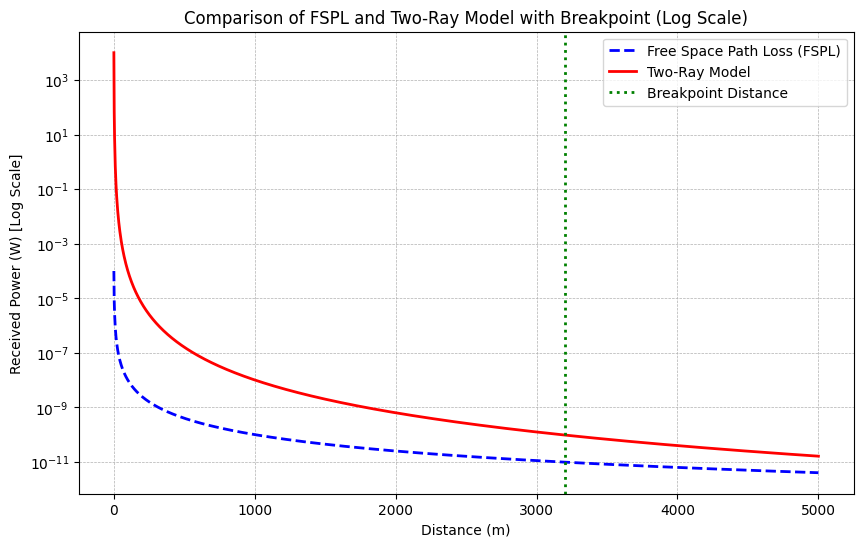

# 📡 Free Space vs Two-Ray Ground Reflection Path Loss Models

This project simulates and compares two fundamental wireless propagation models:

- **Free Space Path Loss (FSPL)**
- **Two-Ray Ground Reflection Model**

It visualizes how the received power changes with distance using both models and marks the **breakpoint distance**, beyond which two-ray behavior dominates.

---

## 📘 Theory Overview

### 1. Free Space Path Loss (FSPL)

The FSPL model assumes ideal line-of-sight propagation without obstacles or reflections.

#### Formula:

%20%3D%2020%20%5Clog_{10}(d)%20%2B%2020%20%5Clog_{10}(f)%20-%20147.55)

The power-based form used in this program:

%5E2)

Where:  
- \(P_r\): Received power (W)  
- \(P_t\): Transmit power (W)  
- \(G_t, G_r\): Antenna gains (unitless)  
- \(\lambda = \frac{c}{f}\): Wavelength (m)  
- \(d\): Distance between transmitter and receiver (m)

---

### 2. Two-Ray Ground Reflection Model

This model accounts for both the direct and ground-reflected signals, better modeling propagation over longer distances.

#### Formula:

Where:  
- \(h_t, h_r\): Transmit and receive antenna heights (m)

---

### 3. Breakpoint Distance

The breakpoint distance marks where the model shifts from FSPL behavior to two-ray model behavior.

#### Formula:

Beyond \(d_{break}\), the received power drops off faster (∝ \(1/d^4\)) compared to FSPL (∝ \(1/d^2\)).

---

## 🧮 Simulation Parameters

| Parameter        | Value      |
|------------------|------------|
| Frequency        | 2.4 GHz    |
| Transmit Power   | 1 W        |
| Antenna Gains    | 1 (unitless) |
| Transmit Height  | 50 m       |
| Receive Height   | 2 m        |
| Distance Range   | 1 m – 5000 m |

---

## 📊 Output

The program plots both FSPL and Two-Ray received power versus distance on a logarithmic scale and marks the breakpoint distance.

---

## 📂 How to Run

1. Install required Python packages:  
   `numpy`, `matplotlib`

2. Run the Python script in your IDE or notebook.

---

## 🔍 Applications

- Wireless communication systems
- Signal coverage estimation
- Antenna design and placement
- Network simulation and planning (e.g., WiFi, 5G, IoT)

---

## 📈 Sample Output

## 🤝 Contributing

Feel free to fork, improve the logic (e.g., include terrain/obstacle loss), or extend it for other propagation models.

